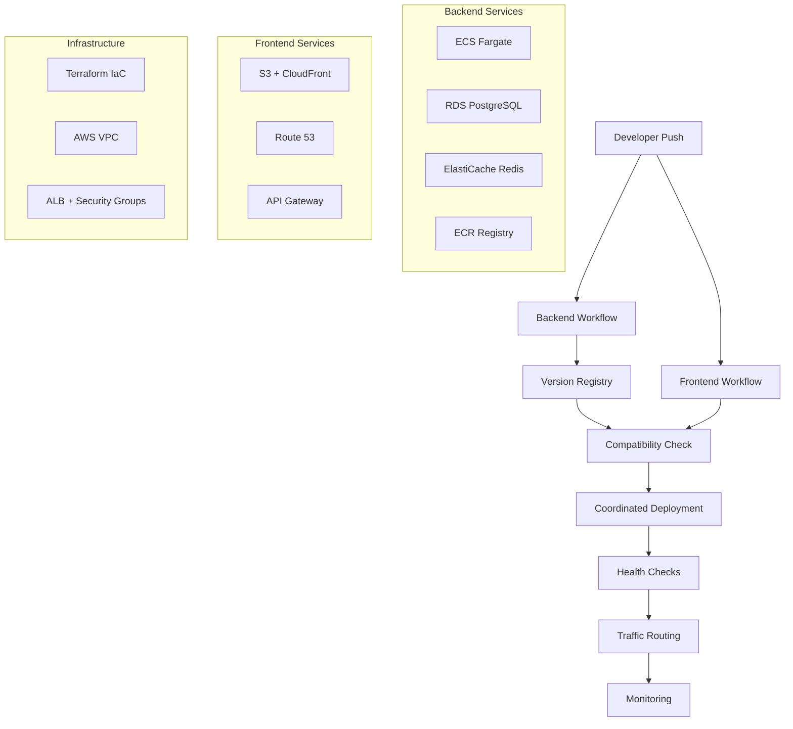

# 🚀 PratikoAI Coordinated CI/CD System

## Architecture Overview

This comprehensive CI/CD system coordinates deployments between your **Kotlin Multiplatform (KMP) frontend** and **FastAPI+LangGraph backend**, implementing advanced deployment strategies with zero manual intervention.

### 🏗️ System Components



## 🎯 Key Features

### ✅ **Coordinated Deployments**
- **Dependency Management**: Backend deploys first, frontend follows after compatibility validation
- **Version Tracking**: Sophisticated version registry tracks compatibility between services
- **Cross-Repository Triggers**: Automatic deployment coordination via GitHub API
- **Feature Flags**: Gradual rollout capabilities with environment-specific toggles

### ✅ **Zero-Downtime Strategies**
- **Blue-Green Deployments**: Complete environment switches for infrastructure changes
- **Canary Releases**: Gradual traffic shifting with automated analysis
- **Rolling Updates**: Standard deployments with health monitoring
- **Fast Deployments**: Optimized for minor changes

### ✅ **Robust Fallback Mechanisms**
- **Automated Rollbacks**: Triggered by health check failures or performance degradation
- **Multi-Layer Health Checks**: API, database, cache, and dependency validation
- **Circuit Breakers**: Prevent cascading failures during deployments
- **Comprehensive Logging**: Detailed audit trails for troubleshooting

### ✅ **Advanced Monitoring**
- **Real-Time Metrics**: CloudWatch + Prometheus + Grafana integration
- **Cross-Service Alerts**: Coordinated alerting for distributed system issues
- **Performance Analytics**: Response times, error rates, throughput tracking
- **Custom Dashboards**: Environment-specific monitoring views

## 📁 File Structure

```
PratikoAi-BE/
├── .github/workflows/
│   └── coordination-system.yml           # Backend deployment workflow
├── terraform/
│   ├── main.tf                          # Main infrastructure configuration
│   ├── variables.tf                     # Environment variables
│   └── modules/
│       ├── networking/                  # VPC, subnets, security groups
│       ├── ecs/                        # Container orchestration
│       ├── database/                   # RDS PostgreSQL
│       ├── cache/                      # ElastiCache Redis
│       ├── ecr/                       # Container registry
│       ├── frontend/                  # CloudFront + S3
│       ├── monitoring/                # CloudWatch + Grafana
│       └── mcp/                      # MCP server configuration
├── scripts/
│   ├── deploy.py                       # Advanced deployment system
│   └── version-manager.py              # Version coordination
├── tests/contract/
│   └── contract-test-framework.py      # API contract validation
└── CICD_SYSTEM.md                     # This documentation

PratikoAi-KMP/
└── .github/workflows/
    └── coordinated-deployment.yml      # Frontend deployment workflow
```

## 🚀 Quick Start Guide

### 1. Infrastructure Setup

```bash
# Clone repositories
git clone https://github.com/mickgian/PratikoAi-BE.git
git clone https://github.com/mickgian/PratikoAi-KMP.git

# Setup Terraform backend
cd PratikoAi-BE/terraform
terraform init
terraform workspace new development

# Deploy infrastructure
terraform plan -var-file="environments/development.tfvars"
terraform apply -var-file="environments/development.tfvars"
```

### 2. Configure Secrets

#### GitHub Repository Secrets (Backend)
```yaml
AWS_ACCESS_KEY_ID: your-aws-access-key
AWS_SECRET_ACCESS_KEY: your-aws-secret-key
AWS_ACCOUNT_ID: your-aws-account-id
CROSS_REPO_TOKEN: github-token-with-repo-access
VERSION_REGISTRY_TOKEN: version-registry-api-token
LLM_API_KEY: your-openai-api-key
LANGFUSE_PUBLIC_KEY: your-langfuse-public-key
LANGFUSE_SECRET_KEY: your-langfuse-secret-key
```

#### GitHub Repository Secrets (Frontend)
```yaml
AWS_ACCESS_KEY_ID: your-aws-access-key
AWS_SECRET_ACCESS_KEY: your-aws-secret-key
VERSION_REGISTRY_TOKEN: version-registry-api-token
GOOGLE_PLAY_API_KEY: google-play-console-key
```

### 3. Environment Configuration

Create environment-specific variable files:

```hcl
# environments/development.tfvars
environment = "development"
db_instance_class = "db.t3.micro"
backend_desired_count = 1
enable_nat_gateway = false
llm_api_key = "your-openai-key"
```

```hcl
# environments/production.tfvars
environment = "production"
db_instance_class = "db.r6g.large"
backend_desired_count = 3
enable_nat_gateway = true
certificate_arn = "arn:aws:acm:us-east-1:123456789012:certificate/abc123"
llm_api_key = "your-openai-key"
```

## 🔄 Deployment Workflows

### Backend Deployment Flow

1. **Code Change Detection**
   ```yaml
   triggers:
     - push to main/develop
     - manual workflow dispatch
     - cross-repo triggers from frontend
   ```

2. **Analysis & Planning**
   - Analyze changed files
   - Determine deployment strategy
   - Generate version compatibility matrix
   - Check infrastructure readiness

3. **Deployment Execution**
   ```python
   # Deployment strategies
   strategies = {
       'infrastructure_changes': 'blue-green',
       'api_changes': 'canary',
       'core_logic': 'rolling',
       'minor_changes': 'fast'
   }
   ```

4. **Health Validation**
   - Multi-layer health checks
   - Database connectivity tests
   - API contract validation
   - Performance benchmarking

5. **Frontend Coordination**
   - Update version registry
   - Trigger frontend deployment
   - Monitor cross-service compatibility

### Frontend Deployment Flow

1. **Compatibility Validation**
   - Check backend version compatibility
   - Validate API contract compliance
   - Analyze breaking changes

2. **Multi-Platform Build**
   ```yaml
   platforms:
     - android: Build APK, run tests
     - ios: Build framework, run tests
     - desktop: Build executable
     - wasm: Build web distribution
   ```

3. **Integration Testing**
   - API integration tests
   - End-to-end functionality tests
   - Cross-platform compatibility tests

4. **Distribution Deployment**
   - Google Play Store (Android)
   - App Store Connect (iOS)
   - S3 + CloudFront (Web)

## 🛡️ Security & Compliance

### Infrastructure Security
- **VPC Isolation**: Private subnets for services, database subnets isolated
- **Security Groups**: Least-privilege access control
- **Network ACLs**: Additional layer of network security
- **KMS Encryption**: All data encrypted at rest and in transit
- **Secrets Management**: AWS Secrets Manager for sensitive data

### Deployment Security
- **Image Scanning**: Container vulnerability scanning
- **RBAC**: Role-based access control for deployments
- **Audit Logging**: Complete deployment audit trails
- **Secret Rotation**: Automated credential rotation

### Compliance Features
- **SOC 2 Type II**: Infrastructure designed for compliance
- **GDPR Ready**: Data protection and privacy controls
- **HIPAA Compatible**: Healthcare data protection measures
- **PCI DSS**: Payment card industry compliance features

## 📊 Monitoring & Observability

### Metrics Collection
```yaml
backend_metrics:
  - API response times (P50, P95, P99)
  - Error rates by endpoint
  - Database query performance
  - Cache hit/miss rates
  - Container resource utilization

frontend_metrics:
  - App launch times
  - User engagement metrics
  - Crash rates by platform
  - API call success rates
  - Performance benchmarks
```

### Alerting Rules
```yaml
critical_alerts:
  - API error rate > 5%
  - Database connection failures
  - Container memory usage > 90%
  - Deployment rollback triggered

warning_alerts:
  - API response time > 2000ms
  - Cache miss rate > 20%
  - Disk usage > 80%
  - Canary deployment concerns
```

### Dashboards
- **System Overview**: High-level health across all services
- **API Performance**: Detailed backend API metrics
- **Frontend Analytics**: Mobile app and web performance
- **Infrastructure Health**: AWS resource utilization
- **Deployment History**: Deployment success rates and trends

## 🔧 Advanced Configuration

### Custom Deployment Strategies

You can create custom deployment strategies by extending the deployment script:

```python
# scripts/custom_strategies.py
class CustomCanaryStrategy(DeploymentStrategy):
    async def execute(self, config):
        # Implement custom canary logic
        # e.g., geographic rollout, user segment targeting
        pass
```

### Feature Flag Configuration

```yaml
# Feature flags for gradual rollouts
feature_flags:
  new_chat_interface:
    development: true
    staging: true
    production: false
  
  enhanced_ai_models:
    development: true
    staging: false
    production: false
```

### Environment-Specific Overrides

```yaml
# Override default configurations per environment
environment_overrides:
  development:
    log_level: DEBUG
    db_instance_class: db.t3.micro
    enable_debug_endpoints: true
  
  production:
    log_level: INFO
    db_instance_class: db.r6g.large
    enable_debug_endpoints: false
```

## 🐛 Troubleshooting Guide

### Common Issues

#### Backend Deployment Failures
```bash
# Check ECS service status
aws ecs describe-services --cluster praktiko-production --services praktiko-backend-production

# View deployment logs
aws logs get-log-events --log-group-name /aws/ecs/praktiko-production/backend

# Check health endpoints
curl -f https://api-production.praktiko.ai/health
```

#### Frontend Build Issues
```bash
# Check GitHub Actions logs
gh run list --repo mickgian/PratikoAi-KMP

# Verify platform-specific builds
./gradlew assembleRelease  # Android
./gradlew iosSimulatorArm64Test  # iOS
```

#### Cross-Service Compatibility Issues
```bash
# Run contract tests manually
python tests/contract/contract-test-framework.py --environment staging

# Check version registry
curl -H "Authorization: Bearer $TOKEN" https://your-version-registry.com/api/compatibility
```

### Emergency Procedures

#### Manual Rollback
```bash
# Backend rollback
python scripts/deploy.py --service backend --environment production --strategy rolling --rollback

# Frontend rollback (update deployment to previous version)
gh workflow run coordinated-deployment.yml --repo mickgian/PratikoAi-KMP -f backend_version=v1.2.3
```

#### Infrastructure Recovery
```bash
# Terraform state recovery
terraform import aws_ecs_service.backend praktiko-production/praktiko-backend-production

# Database backup restore
aws rds restore-db-instance-from-db-snapshot --db-instance-identifier praktiko-production-restored
```

## 📈 Performance Optimization

### Backend Optimizations
- **Auto Scaling**: CPU and memory-based scaling policies
- **Connection Pooling**: Optimized database connection management
- **Caching Strategy**: Multi-layer caching with Redis
- **CDN Integration**: Static asset delivery optimization

### Frontend Optimizations
- **Build Optimization**: Platform-specific optimizations
- **Asset Bundling**: Efficient resource packaging
- **Lazy Loading**: On-demand feature loading
- **Offline Support**: Progressive web app capabilities

### Infrastructure Optimizations
- **Spot Instances**: Cost optimization for development environments
- **Reserved Instances**: Production cost savings
- **Multi-AZ Deployment**: High availability architecture
- **Auto Scaling Groups**: Dynamic capacity management

## 🔄 Maintenance & Updates

### Regular Maintenance Tasks
```bash
# Weekly dependency updates
./scripts/update-dependencies.sh

# Monthly security patches
./scripts/security-updates.sh

# Quarterly capacity planning
./scripts/capacity-analysis.sh
```

### Version Management
```bash
# Semantic versioning for releases
git tag -a v1.2.3 -m "Release version 1.2.3"

# Hotfix version management
git checkout -b hotfix/v1.2.4 main
```

## 🎯 Best Practices

### Development Workflow
1. **Feature Branches**: Use feature branches for all changes
2. **Pull Requests**: Require PR reviews for all deployments
3. **Testing**: Comprehensive test coverage before merging
4. **Documentation**: Update documentation with feature changes

### Deployment Guidelines
1. **Deploy During Low Traffic**: Schedule major deployments appropriately
2. **Monitor Closely**: Watch metrics during and after deployments
3. **Rollback Quickly**: Don't hesitate to rollback if issues arise
4. **Communicate**: Keep stakeholders informed of deployment status

### Security Guidelines
1. **Least Privilege**: Grant minimum necessary permissions
2. **Regular Audits**: Review access and permissions quarterly
3. **Vulnerability Scanning**: Automated security scanning in CI/CD
4. **Incident Response**: Defined procedures for security incidents

## 📞 Support & Contacts

### Emergency Contacts
- **DevOps Team**: devops@praktiko.ai
- **Platform Team**: platform@praktiko.ai
- **Security Team**: security@praktiko.ai

### Documentation Resources
- **API Documentation**: https://docs.praktiko.ai
- **Infrastructure Runbooks**: https://runbooks.praktiko.ai
- **Monitoring Dashboards**: https://grafana.praktiko.ai

---

**This coordinated CI/CD system provides enterprise-grade deployment capabilities with zero manual intervention, comprehensive monitoring, and robust fallback mechanisms. The system is designed to scale with your growing needs while maintaining reliability and security.**