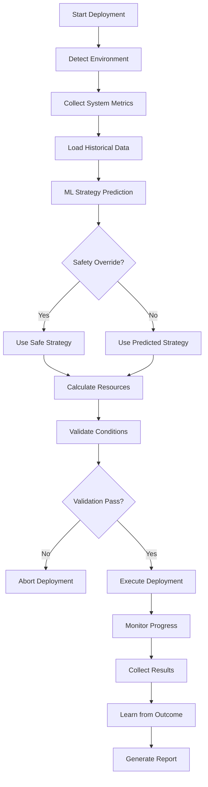

# Intelligent Deployment System Guide

## 🚀 Overview

The Intelligent Deployment System is a self-adapting, machine learning-powered deployment orchestration platform that automatically optimizes deployment strategies based on:

- **Environment Detection**: Automatically identifies local, development, staging, or production environments
- **System Load Analysis**: Real-time monitoring of CPU, memory, disk, and network resources
- **Historical Learning**: Machine learning models that improve deployment success rates over time
- **Dynamic Resource Allocation**: Adapts resource usage based on current system conditions
- **Comprehensive Reporting**: Detailed decision logs and performance analytics

## 📋 Features

### 🧠 Intelligent Strategy Selection
- **Conservative Strategy**: Slow, safe deployments with extensive validation
- **Balanced Strategy**: Moderate speed with reasonable safety measures
- **Aggressive Strategy**: Fast deployments with minimal validation
- **Adaptive Strategy**: ML-driven optimal strategy selection

### 📊 Real-time System Monitoring
- CPU utilization and load average tracking
- Memory usage and availability monitoring
- Disk space and I/O performance analysis
- Network latency and connectivity validation
- System trend analysis and prediction

### 🎯 Machine Learning Optimization
- Random Forest classifier for strategy prediction
- Feature extraction from deployment context
- Continuous learning from deployment outcomes
- Performance prediction and resource estimation
- Failure pattern recognition and mitigation

### 📈 Comprehensive Reporting
- Decision tree logging and analysis
- Performance benchmarking and comparison
- Resource utilization tracking
- Lessons learned extraction
- Recommendations for future deployments

## 🛠️ Installation

### Prerequisites

- Python 3.8 or higher
- pip or uv package manager
- 4GB+ RAM recommended
- 10GB+ free disk space

### Setup Instructions

1. **Clone and Navigate to Directory**:
```bash
cd /path/to/PratikoAi-BE/deployment-orchestration
```

2. **Install Dependencies**:
```bash
# Using pip
pip install -r requirements.txt

# Using uv (recommended)
uv pip install -r requirements.txt
```

3. **Verify Installation**:
```bash
python intelligent_deploy.py --diagnostics
```

4. **Optional: Create Configuration Override**:
```bash
cp deployment_config.yaml my_config.yaml
# Edit my_config.yaml with your specific settings
```

## 🎮 Usage Examples

### Basic Deployment
```bash
# Deploy services with automatic strategy selection
python intelligent_deploy.py --services api-service web-frontend

# Deploy with specific strategy
python intelligent_deploy.py --services api-service --strategy aggressive

# Deploy with time constraint
python intelligent_deploy.py --services api-service web-frontend --max-time 30
```

### Advanced Options
```bash
# Large deployment with interactive confirmation
python intelligent_deploy.py \
  --services api-service web-frontend background-worker \
  --deployment-size large \
  --interactive

# Dry run to test without actual deployment
python intelligent_deploy.py \
  --services api-service web-frontend \
  --dry-run \
  --verbose

# Use custom configuration
python intelligent_deploy.py \
  --services api-service \
  --config my_config.yaml
```

### Monitoring and Analysis
```bash
# Run system diagnostics
python intelligent_deploy.py --diagnostics

# List recent deployments
python intelligent_deploy.py --list-deployments

# View detailed report for specific deployment
python intelligent_deploy.py --report deploy_1234567890

# Get help and see all options
python intelligent_deploy.py --help
```

## 🧩 System Architecture

### Core Components

#### 1. **Environment Detector**
```python
# Automatically detects deployment environment using:
- Environment variables (DEPLOYMENT_ENVIRONMENT)
- Network topology analysis (service discovery)
- Filesystem structure examination (Docker, Kubernetes)
- Running process analysis
- Hostname pattern matching
```

#### 2. **System Monitor**
```python
# Real-time system metrics collection:
- CPU utilization and load average
- Memory usage and availability
- Disk I/O and space utilization
- Network latency measurement
- Historical trend analysis
```

#### 3. **ML Optimizer**
```python
# Machine learning-based optimization:
- Random Forest classifier for strategy selection
- Feature extraction from deployment context
- Continuous model retraining (every 10 deployments)
- Performance prediction and failure analysis
```

#### 4. **Adaptive Engine**
```python
# Main orchestration engine that:
- Coordinates all subsystems
- Makes deployment decisions
- Executes strategy-specific workflows
- Logs comprehensive decision trees
- Generates detailed reports
```

### Decision Flow



## ⚙️ Configuration

### Environment-Specific Settings

Edit `deployment_config.yaml` to customize behavior:

```yaml
# Resource limits by strategy
resource_limits:
  conservative:
    cpu_limit: 0.4          # 40% max CPU usage
    memory_limit: 0.5       # 50% max memory usage
    concurrency: 2          # 2 parallel processes
    
  aggressive:
    cpu_limit: 0.9          # 90% max CPU usage
    memory_limit: 0.9       # 90% max memory usage
    concurrency: 8          # 8 parallel processes

# System health thresholds
thresholds:
  high_cpu: 80.0           # CPU threshold for caution
  critical_memory: 95.0    # Memory threshold for blocking
  max_deployment_time: 60  # Maximum deployment duration
```

### Machine Learning Configuration

```yaml
ml_config:
  model_type: "random_forest"
  retrain_frequency: 10     # Retrain every 10 deployments
  min_training_samples: 20  # Minimum data for training
  
  feature_weights:
    system_cpu: 1.0
    historical_success_rate: 1.2
    environment_type: 1.1
```

### Environment Detection Rules

```yaml
environment_detection:
  hostname_patterns:
    production: ["prod", "production", "prd"]
    staging: ["staging", "stage", "stg"]
    development: ["dev", "development", "local"]
    
  network_patterns:
    production: ["api.pratiko.ai", "pratiko.com"]
    staging: ["staging.pratiko.ai"]
    development: ["localhost", "127.0.0.1"]
```

## 📊 Understanding Reports

### Deployment Summary
```json
{
  "deployment_summary": {
    "id": "deploy_1234567890",
    "success": true,
    "duration_minutes": 23.5,
    "strategy_used": "balanced",
    "environment": "staging"
  }
}
```

### Decision Process
```json
{
  "decision_process": [
    {
      "timestamp": "2024-01-15T10:00:00",
      "decision_type": "environment_detected",
      "details": {"environment": "staging", "confidence": 0.85}
    },
    {
      "timestamp": "2024-01-15T10:00:05",
      "decision_type": "strategy_predicted",
      "details": {"strategy": "balanced", "confidence": 0.78}
    }
  ]
}
```

### Performance Analysis
```json
{
  "performance_analysis": {
    "duration_performance": "good",
    "benchmark_duration": 30.0,
    "actual_duration": 23.5,
    "duration_variance": -6.5
  }
}
```

### System Impact
```json
{
  "system_impact": {
    "cpu_impact_percent": 15.2,
    "memory_impact_percent": 8.7,
    "overall_impact": "low"
  }
}
```

## 🔧 Troubleshooting

### Common Issues

#### 1. **Environment Detection Failures**
```bash
# Symptoms: System detects wrong environment
# Solution: Set explicit environment variable
export DEPLOYMENT_ENVIRONMENT=staging
python intelligent_deploy.py --services api-service
```

#### 2. **ML Model Training Errors**
```bash
# Symptoms: Strategy prediction failures
# Solution: Delete model files to retrain
rm -rf deployment_data/deployment_model.joblib
rm -rf deployment_data/feature_scaler.joblib
```

#### 3. **High Resource Usage Blocking Deployments**
```bash
# Symptoms: "System resources too high" errors
# Solution: Use conservative strategy or wait for lower load
python intelligent_deploy.py --services api-service --strategy conservative
```

#### 4. **Network Connectivity Issues**
```bash
# Symptoms: High network latency detected
# Solution: Check network connectivity
ping 8.8.8.8
python intelligent_deploy.py --diagnostics
```

### Debug Mode

Enable detailed debugging:
```bash
# Enable verbose logging
python intelligent_deploy.py --services api-service --verbose

# Check system diagnostics
python intelligent_deploy.py --diagnostics

# Use dry run for testing
python intelligent_deploy.py --services api-service --dry-run
```

### Log Analysis

Deployment logs are saved to:
```
deployment_logs/deploy_YYYYMMDD_HHMMSS.log
deployment_reports/deployment_report_DEPLOYMENT_ID.json
deployment_data/deployment_history.db
```

## 🎯 Best Practices

### 1. **Regular Model Training**
- Run deployments regularly to build ML model training data
- Review deployment reports to identify improvement opportunities
- Use diverse deployment scenarios (different times, loads, services)

### 2. **Environment-Specific Configuration**
- Customize thresholds for each environment type
- Use more conservative settings for production
- Enable experimental features only in development

### 3. **Monitoring and Alerting**
- Set up monitoring for deployment success rates
- Alert on consecutive deployment failures
- Track resource usage trends over time

### 4. **Security Considerations**
- Regularly review audit logs
- Use secure storage for deployment history
- Implement access controls for production deployments

### 5. **Performance Optimization**
- Monitor deployment duration trends
- Optimize resource allocation based on usage patterns
- Use aggressive strategies during low-usage periods

## 🔮 Advanced Features

### Integration with CI/CD

Add to your GitHub Actions workflow:
```yaml
- name: Intelligent Deployment
  run: |
    python deployment-orchestration/intelligent_deploy.py \
      --services ${{ inputs.services }} \
      --deployment-size ${{ inputs.size }} \
      --max-time 45
```

### Custom Hooks

Extend functionality with custom hooks:
```yaml
hooks:
  pre_deployment_scripts:
    - "scripts/backup_database.sh"
    - "scripts/notify_team.py"
  post_deployment_scripts:
    - "scripts/run_smoke_tests.sh"
    - "scripts/update_monitoring.py"
```

### Predictive Analytics

Enable experimental predictive features:
```yaml
experimental:
  enable_predictive_scaling: true
  enable_canary_deployments: true
  enable_rollback_prediction: true
```

## 📚 API Reference

### Core Classes

#### `AdaptiveDeploymentEngine`
Main orchestration engine with methods:
- `execute_adaptive_deployment()`: Main deployment execution
- `generate_deployment_report()`: Create comprehensive reports

#### `EnvironmentDetector`
Environment detection with methods:
- `detect_environment()`: Identify current environment
- Multiple detection methods with confidence scoring

#### `SystemMonitor`
System monitoring with methods:
- `get_current_metrics()`: Real-time system metrics
- `get_system_trend()`: Historical trend analysis

#### `DeploymentMLOptimizer`
Machine learning optimization with methods:
- `predict_optimal_strategy()`: ML-based strategy selection
- `learn_from_deployment()`: Continuous learning from results

### Configuration Schema

See `deployment_config.yaml` for complete configuration options with detailed comments.

## 🤝 Contributing

### Development Setup

1. **Install development dependencies**:
```bash
pip install -r requirements.txt
pytest coverage mypy
```

2. **Run tests**:
```bash
pytest tests/ --cov=deployment_orchestration
```

3. **Type checking**:
```bash
mypy adaptive_deployment_engine.py intelligent_deploy.py
```

### Adding New Features

1. **Environment Detection**: Extend `EnvironmentDetector` class
2. **ML Features**: Add features to `extract_features()` method
3. **Deployment Strategies**: Extend strategy execution methods
4. **Reporting**: Add new analysis to report generation

## 🆘 Support

For issues and questions:

1. **Check system diagnostics**: `python intelligent_deploy.py --diagnostics`
2. **Review recent deployments**: `python intelligent_deploy.py --list-deployments`
3. **Enable verbose logging**: Use `--verbose` flag
4. **Check configuration**: Verify `deployment_config.yaml` settings

## 📈 Roadmap

Planned future enhancements:
- **Multi-cloud deployment support**
- **Kubernetes native integration**
- **Advanced failure prediction**
- **Cost optimization algorithms**
- **Real-time collaboration features**
- **Enhanced security and compliance**

---

This intelligent deployment system represents a significant advancement in automated deployment orchestration, providing the adaptability and learning capabilities needed for modern, dynamic infrastructure environments.