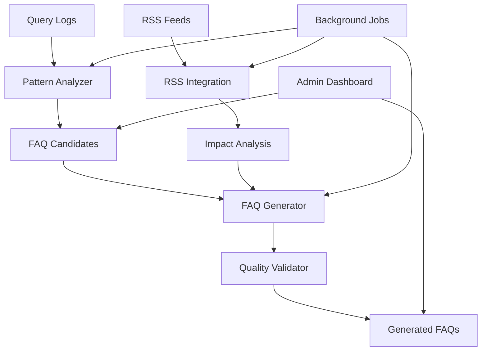

# Automated FAQ Generation System

## Overview

The Automated FAQ Generation System for PratikoAI analyzes user query patterns, automatically generates high-quality FAQ entries from successful LLM responses, and maintains FAQ accuracy through RSS integration with Italian regulatory sources.

### Key Benefits

- **Cost Reduction**: From €2/user to ~€1.70/user (15% savings)
- **Quality Assurance**: Multi-criteria validation ensuring professional standards
- **Regulatory Compliance**: Automatic updates when Italian tax regulations change
- **ROI-Driven**: Prioritizes FAQ candidates based on usage frequency and cost savings

## Architecture

### System Components



### Core Services

1. **Query Pattern Analyzer** (`app/services/query_pattern_analyzer.py`)
   - Semantic clustering using DBSCAN algorithm
   - ROI calculation and prioritization
   - Italian language optimization

2. **Automated FAQ Generator** (`app/services/auto_faq_generator.py`)
   - Tiered LLM approach (GPT-3.5 → GPT-4 if needed)
   - Italian professional language generation
   - Cost optimization strategies

3. **FAQ Quality Validator** (`app/services/faq_quality_validator.py`)
   - Multi-criteria quality assessment
   - Regulatory compliance checking
   - Professional language validation

4. **RSS Integration** (`app/services/faq_rss_integration.py`)
   - Italian government source monitoring
   - Impact analysis on existing FAQs
   - Automatic update triggering

5. **Background Jobs** (`app/services/faq_background_jobs.py`)
   - Scheduled analysis and generation
   - System maintenance tasks
   - Batch processing capabilities

## Database Schema

### Core Tables

```sql
-- Query clusters from pattern analysis
CREATE TABLE query_clusters (
    id UUID PRIMARY KEY,
    canonical_query VARCHAR(500) NOT NULL,
    normalized_form VARCHAR(500) NOT NULL,
    query_count INTEGER NOT NULL DEFAULT 0,
    avg_cost_cents INTEGER NOT NULL DEFAULT 0,
    potential_savings_cents INTEGER NOT NULL DEFAULT 0,
    avg_quality_score DECIMAL(3,2) NOT NULL DEFAULT 0,
    roi_score DECIMAL(10,2) NOT NULL DEFAULT 0,
    priority_score DECIMAL(10,2) NOT NULL DEFAULT 0,
    query_variations TEXT[] NOT NULL DEFAULT '{}',
    semantic_tags VARCHAR(50)[] NOT NULL DEFAULT '{}',
    processing_status VARCHAR(20) NOT NULL DEFAULT 'discovered',
    first_seen TIMESTAMP WITH TIME ZONE NOT NULL,
    last_seen TIMESTAMP WITH TIME ZONE NOT NULL,
    created_at TIMESTAMP WITH TIME ZONE DEFAULT NOW(),
    updated_at TIMESTAMP WITH TIME ZONE
);

-- FAQ candidates identified by analysis
CREATE TABLE faq_candidates (
    id UUID PRIMARY KEY,
    cluster_id UUID REFERENCES query_clusters(id),
    suggested_question TEXT NOT NULL,
    best_response_content TEXT NOT NULL,
    best_response_id UUID,
    suggested_category VARCHAR(100),
    suggested_tags VARCHAR(50)[] DEFAULT '{}',
    frequency INTEGER NOT NULL,
    estimated_monthly_savings DECIMAL(10,2) NOT NULL DEFAULT 0,
    roi_score DECIMAL(10,2) NOT NULL DEFAULT 0,
    priority_score DECIMAL(10,2) NOT NULL DEFAULT 0,
    status VARCHAR(30) NOT NULL DEFAULT 'pending',
    generation_attempts INTEGER NOT NULL DEFAULT 0,
    max_generation_attempts INTEGER NOT NULL DEFAULT 3,
    expires_at TIMESTAMP WITH TIME ZONE,
    analysis_metadata JSONB,
    created_at TIMESTAMP WITH TIME ZONE DEFAULT NOW(),
    updated_at TIMESTAMP WITH TIME ZONE
);

-- Generated FAQs with quality metrics
CREATE TABLE generated_faqs (
    id UUID PRIMARY KEY,
    candidate_id UUID REFERENCES faq_candidates(id),
    question TEXT NOT NULL,
    answer TEXT NOT NULL,
    category VARCHAR(100),
    tags VARCHAR(50)[] DEFAULT '{}',
    quality_score DECIMAL(3,2) NOT NULL,
    regulatory_refs VARCHAR(200)[] DEFAULT '{}',
    generation_model VARCHAR(50) NOT NULL,
    generation_cost_cents INTEGER NOT NULL DEFAULT 0,
    estimated_monthly_savings DECIMAL(10,2) NOT NULL DEFAULT 0,
    approval_status VARCHAR(30) NOT NULL DEFAULT 'pending_review',
    published BOOLEAN DEFAULT FALSE,
    usage_count INTEGER DEFAULT 0,
    satisfaction_score DECIMAL(3,2),
    auto_generated BOOLEAN DEFAULT TRUE,
    generation_metadata JSONB,
    created_at TIMESTAMP WITH TIME ZONE DEFAULT NOW(),
    published_at TIMESTAMP WITH TIME ZONE
);

-- RSS impact tracking
CREATE TABLE rss_faq_impacts (
    id UUID PRIMARY KEY,
    faq_id UUID REFERENCES generated_faqs(id),
    rss_update_id UUID NOT NULL,
    impact_level VARCHAR(20) NOT NULL, -- low, medium, high, critical
    impact_score DECIMAL(3,2) NOT NULL,
    confidence_score DECIMAL(3,2) NOT NULL,
    rss_source VARCHAR(200) NOT NULL,
    rss_title TEXT NOT NULL,
    rss_published_date TIMESTAMP WITH TIME ZONE NOT NULL,
    matching_keywords VARCHAR(100)[] DEFAULT '{}',
    action_required VARCHAR(50) NOT NULL, -- review, regenerate, ignore
    processed BOOLEAN DEFAULT FALSE,
    action_taken VARCHAR(50),
    action_date TIMESTAMP WITH TIME ZONE,
    created_at TIMESTAMP WITH TIME ZONE DEFAULT NOW()
);
```

## Configuration

### System Configuration (`FAQ_AUTOMATION_CONFIG`)

```python
FAQ_AUTOMATION_CONFIG = {
    "pattern_analysis": {
        "min_frequency": 5,              # Minimum query frequency for FAQ candidate
        "time_window_days": 30,          # Analysis time window
        "similarity_threshold": 0.85,    # Semantic similarity threshold
        "min_quality_score": 0.8         # Minimum response quality required
    },
    "generation": {
        "quality_threshold": 0.85,       # Minimum quality for acceptance
        "auto_approve_threshold": 0.95,  # Auto-approval threshold
        "max_generation_attempts": 3,    # Maximum generation retries
        "cheap_model": "gpt-3.5-turbo",  # Cost-effective model
        "expensive_model": "gpt-4",      # High-quality model
        "max_tokens": 500                # Maximum response length
    },
    "rss_integration": {
        "high_impact_threshold": 0.7,    # High impact threshold
        "medium_impact_threshold": 0.3,  # Medium impact threshold
        "update_check_hours": 4,         # RSS check frequency
        "max_updates_per_batch": 50      # Maximum updates per batch
    },
    "business_rules": {
        "min_roi_score": 0.5,           # Minimum ROI for FAQ candidate
        "max_candidates_per_run": 20,    # Maximum candidates per analysis
        "candidate_expiry_days": 7,      # Candidate expiration time
        "min_monthly_savings": 1.0       # Minimum monthly savings (€)
    }
}
```

## API Endpoints

### Admin Dashboard

#### Get Dashboard Statistics
```http
GET /api/v1/faq-automation/dashboard?days=30
```

**Response:**
```json
{
    "candidates": {
        "total": 45,
        "pending": 12,
        "processing": 3,
        "completed": 30,
        "avg_roi_score": 2.34,
        "total_potential_savings": 125.50,
        "top_categories": [
            {"category": "IVA", "count": 15},
            {"category": "IRPEF", "count": 12}
        ]
    },
    "generated_faqs": {
        "total": 30,
        "auto_approved": 18,
        "manually_approved": 8,
        "pending_review": 4,
        "published": 25,
        "avg_quality_score": 0.89,
        "total_generation_cost": 12.45,
        "total_usage": 1250
    },
    "rss_impacts": {
        "total_impacts": 8,
        "high_impact": 2,
        "medium_impact": 4,
        "pending_action": 3,
        "avg_confidence": 0.78
    }
}
```

### FAQ Candidates Management

#### List FAQ Candidates
```http
GET /api/v1/faq-automation/candidates?status=pending&min_roi=1.0&limit=20
```

#### Trigger Pattern Analysis
```http
POST /api/v1/faq-automation/candidates/analyze
```

#### Generate FAQs from Candidates
```http
POST /api/v1/faq-automation/candidates/generate
Content-Type: application/json

{
    "candidate_ids": ["uuid1", "uuid2"],
    "force_expensive_model": false,
    "auto_approve_high_quality": true
}
```

### Generated FAQs Management

#### List Generated FAQs
```http
GET /api/v1/faq-automation/faqs?approval_status=pending_review&min_quality=0.8
```

#### Approve FAQ
```http
POST /api/v1/faq-automation/faqs/{faq_id}/approve
Content-Type: application/json

{
    "approval_status": "manually_approved",
    "notes": "Approved after legal review"
}
```

#### Publish FAQ
```http
POST /api/v1/faq-automation/faqs/{faq_id}/publish
```

### RSS Integration

#### Check RSS Updates
```http
POST /api/v1/faq-automation/rss/check-updates
```

#### List RSS Impacts
```http
GET /api/v1/faq-automation/rss/impacts?impact_level=high&processed=false
```

## Implementation Workflow

### 1. Query Pattern Analysis

```python
from app.services.query_pattern_analyzer import QueryPatternAnalyzer

# Initialize analyzer
analyzer = QueryPatternAnalyzer(db, embedding_service, normalizer)

# Find FAQ candidates
candidates = await analyzer.find_faq_candidates()

# Results: List of FAQCandidate objects with ROI scores
for candidate in candidates:
    print(f"Question: {candidate.suggested_question}")
    print(f"ROI Score: {candidate.roi_score}")
    print(f"Monthly Savings: €{candidate.estimated_monthly_savings}")
```

### 2. FAQ Generation

```python
from app.services.auto_faq_generator import AutomatedFAQGenerator

# Initialize generator
generator = AutomatedFAQGenerator(llm_service, quality_validator, db)

# Generate FAQ from candidate
generated_faq = await generator.generate_faq_from_candidate(candidate)

print(f"Generated FAQ:")
print(f"Q: {generated_faq.question}")
print(f"A: {generated_faq.answer}")
print(f"Quality Score: {generated_faq.quality_score}")
print(f"Approval Status: {generated_faq.approval_status}")
```

### 3. Quality Validation

```python
from app.services.faq_quality_validator import FAQQualityValidator

# Initialize validator
validator = FAQQualityValidator(llm_service, embedding_service)

# Validate FAQ quality
quality_score = await validator.validate_faq(
    question=faq.question,
    answer=faq.answer,
    original_response=original_response
)

# Get detailed quality assessment
quality_details = await validator.get_quality_details(
    question=faq.question,
    answer=faq.answer,
    original_response=original_response
)

print(f"Quality Score: {quality_score}")
print(f"Meets Threshold: {quality_details['meets_threshold']}")
print(f"Recommendations: {quality_details['recommendations']}")
```

### 4. RSS Integration

```python
from app.services.faq_rss_integration import FAQRSSIntegration

# Initialize RSS integration
rss_service = FAQRSSIntegration(db, llm_service, embedding_service)

# Check for regulatory updates
update_results = await rss_service.check_for_updates()

print(f"Updates Found: {update_results['total_updates']}")
print(f"FAQs Affected: {update_results['faqs_affected']}")
print(f"High Impact: {update_results['high_impact']}")

# Get pending actions
pending_actions = await rss_service.get_pending_actions()
for action in pending_actions:
    if action['requires_immediate_action']:
        print(f"URGENT: {action['rss_title']}")
        print(f"FAQ Impact: {action['faq_id']}")
        print(f"Action: {action['action_required']}")
```

## Testing

### Test Structure

The system includes comprehensive TDD test coverage:

```bash
# Run all FAQ automation tests
pytest tests/test_faq_automation.py -v

# Run specific test categories
pytest tests/test_faq_automation.py::TestQueryPatternAnalysis -v
pytest tests/test_faq_automation.py::TestFAQGeneration -v
pytest tests/test_faq_automation.py::TestQualityValidation -v
pytest tests/test_faq_automation.py::TestRSSIntegration -v
```

### Key Test Scenarios

1. **Pattern Analysis Tests**
   - Query clustering accuracy
   - ROI calculation validation
   - Italian language processing
   - Minimum frequency thresholds

2. **FAQ Generation Tests**
   - Tiered LLM usage (cheap → expensive)
   - Italian professional language quality
   - Regulatory reference extraction
   - Cost optimization validation

3. **Quality Validation Tests**
   - Multi-criteria scoring accuracy
   - Professional language detection
   - Regulatory compliance checking
   - Threshold-based approval logic

4. **RSS Integration Tests**
   - Feed parsing and impact analysis
   - Semantic similarity matching
   - Impact level classification
   - Action prioritization

## Cost Analysis

### Current vs. Automated Costs

| Scenario | Current Cost | Automated Cost | Savings |
|----------|-------------|----------------|---------|
| First-time query | €2.00 | €2.00 | €0.00 |
| FAQ variation (5+ occurrences) | €2.00 | €0.0003 | €1.9997 |
| Monthly 100 unique + 400 variations | €1000 | €860 | €140 (14%) |

### ROI Calculation

```python
def calculate_faq_roi(candidate: FAQCandidate) -> Decimal:
    """Calculate return on investment for FAQ candidate"""
    
    # Monthly query volume projection
    monthly_queries = candidate.frequency * (30 / analysis_window_days)
    
    # Current costs (expensive model for each query)
    current_monthly_cost = monthly_queries * 2.00  # €2 per query
    
    # FAQ costs (cheap model for variations)
    faq_monthly_cost = monthly_queries * 0.0003  # €0.0003 per variation
    generation_cost = 0.001  # One-time generation cost
    
    # Monthly savings
    monthly_savings = current_monthly_cost - faq_monthly_cost
    
    # ROI = Monthly savings / Generation cost
    roi = monthly_savings / generation_cost
    
    return Decimal(str(roi))
```

## Deployment

### Environment Variables

```env
# FAQ Automation Configuration
FAQ_MIN_FREQUENCY=5
FAQ_SIMILARITY_THRESHOLD=0.85
FAQ_QUALITY_THRESHOLD=0.85
FAQ_AUTO_APPROVE_THRESHOLD=0.95

# LLM Configuration
FAQ_CHEAP_MODEL=gpt-3.5-turbo
FAQ_EXPENSIVE_MODEL=gpt-4
FAQ_MAX_TOKENS=500

# RSS Integration
RSS_CHECK_INTERVAL_HOURS=4
RSS_HIGH_IMPACT_THRESHOLD=0.7

# Background Jobs
FAQ_MAX_CONCURRENT_JOBS=3
FAQ_JOB_TIMEOUT_MINUTES=30
```

### Database Migration

```bash
# Create FAQ automation tables
alembic revision --autogenerate -m "Add FAQ automation tables"
alembic upgrade head

# Import initial data (if any)
python scripts/import_faq_automation_data.py
```

### Production Deployment

```bash
# Install dependencies
uv sync

# Run database migrations
alembic upgrade head

# Start background job processor
python scripts/start_faq_job_processor.py

# Start API server
uvicorn app.main:app --host 0.0.0.0 --port 8000
```

## Monitoring and Maintenance

### Key Metrics to Monitor

1. **System Performance**
   - FAQ generation success rate (target: >95%)
   - Average generation time (target: <2 minutes)
   - Quality score distribution (target: avg >0.85)

2. **Business Impact**
   - Cost savings achieved (€ per month)
   - FAQ usage rates (queries answered by FAQs)
   - Customer satisfaction scores

3. **RSS Integration**
   - Update detection accuracy
   - False positive rates
   - Response time to regulatory changes

### Maintenance Tasks

1. **Daily**
   - Pattern analysis for new candidates
   - RSS feed monitoring
   - Quality validation of generated FAQs

2. **Weekly**
   - Expired candidate cleanup
   - Usage statistics update
   - Performance metrics review

3. **Monthly**
   - ROI analysis and reporting
   - Model performance evaluation
   - System optimization review

## Troubleshooting

### Common Issues

#### Low FAQ Generation Quality
```python
# Check quality validation settings
if quality_score < FAQ_AUTOMATION_CONFIG["generation"]["quality_threshold"]:
    # Force expensive model usage
    generator.force_expensive_model = True
    
    # Regenerate with higher quality standards
    regenerated_faq = await generator.generate_faq_from_candidate(
        candidate, 
        force_expensive=True
    )
```

#### RSS Integration False Positives
```python
# Adjust impact thresholds
config = FAQ_AUTOMATION_CONFIG["rss_integration"]
config["medium_impact_threshold"] = 0.4  # Increase threshold
config["high_impact_threshold"] = 0.8    # Increase threshold

# Recalculate impacts
rss_service.recalculate_pending_impacts()
```

#### Poor Clustering Results
```python
# Adjust clustering parameters
analyzer.similarity_threshold = 0.90  # Higher similarity requirement
analyzer.min_frequency = 8            # Higher frequency requirement

# Rerun analysis
new_candidates = await analyzer.find_faq_candidates()
```

### Performance Optimization

1. **Database Indexing**
   ```sql
   CREATE INDEX CONCURRENTLY idx_faq_candidates_priority 
   ON faq_candidates(priority_score DESC, created_at DESC);
   
   CREATE INDEX CONCURRENTLY idx_generated_faqs_usage 
   ON generated_faqs(usage_count DESC, satisfaction_score DESC);
   ```

2. **Caching Strategy**
   - Cache embedding calculations for 24 hours
   - Cache RSS feed results for 4 hours
   - Cache quality validation results for 1 hour

3. **Batch Processing**
   - Process multiple candidates concurrently
   - Limit concurrent LLM requests to avoid rate limits
   - Use background jobs for time-intensive operations

## Security Considerations

### Data Protection

1. **Query Content**: Anonymize personal information in query logs
2. **Generated Content**: Validate regulatory compliance before publication
3. **RSS Integration**: Verify source authenticity and content integrity

### Access Control

1. **Admin Dashboard**: Require admin authentication for all endpoints
2. **API Rate Limiting**: Implement rate limits to prevent abuse
3. **Audit Logging**: Log all administrative actions and changes

### Compliance

1. **GDPR**: Ensure no personal data is stored in FAQ content
2. **Professional Standards**: Validate all generated content meets professional standards
3. **Regulatory Accuracy**: Maintain traceability to official sources

---

This comprehensive system provides automated FAQ generation with quality assurance, cost optimization, and regulatory compliance for the Italian tax and accounting professional market. The TDD approach ensures reliability and maintainability while the modular architecture supports future enhancements.